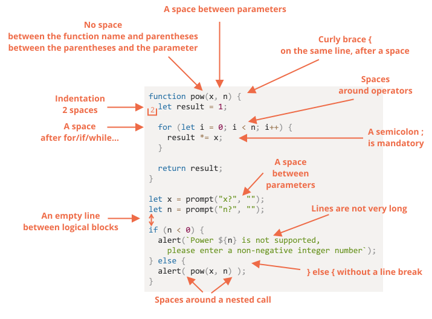

# أسلوب كتابة الكود

يجب أن يكون الكود الخاص بنا نظيف وسهل القراءة قدر الإمكان.

هذا هو في الواقع فن البرمجة ... القيام بمهمة معقدة و كتابة الكود الخاص بها بطريقة صحيحة و قابلة للقراءة بواسطة مبرمج آخر. لذا يساعد أسلوب كتابة الكود الجيد إلى حد كبير في ذلك.

## طريقة كتابة الكود

إليك تجميعة لبعض القواعد المقترحة (انظر أدناه لمزيد من التفاصيل):


<!--
```js
function pow(x, n) {
  let result = 1;

  for (let i = 0; i < n; i++) {
    result *= x;
  }

  return result;
}

let x = prompt("x?", "");
let n = prompt("n?", "");

if (n < 0) {
  alert(`Power ${n} is not supported,
    please enter a non-negative integer number`);
} else {
  alert( pow(x, n) );
}
```

-->

الآن دعونا نناقش القواعد وأسبابها بالتفصيل.

```warn header="لا توجد قاعدة \"يجب أن تفعل كذا\""
لا يوجد شيء محدد هنا. هي مجرد تفضيلات لأسلوب الكتابة ، ليست كالعقائد الدينية.
```

### الأقواس المعقوفة

في معظم مشاريع جافا سكريبت ، يتم كتابة الأقواس المعقوفة بأسلوب "مصري" مع قوس فتح على نفس السطر مثل الكلمة الرئيسية المقابلة - وليس على سطر جديد. يجب أيضًا أن يكون هناك مسافة قبل قوس الفتح ، كالتالي:

```js
if (condition) {
  // do this
  // ...and that
  // ...and that
}
```

بناء أحادي الخط مثل`if (condition) doSomething()`, هي قضية مهمة.هل يجب علينا استخدام الأقواس من الأساس؟

إليك المتغيرات التي تحكم على مدى سهولة قراءتها بنفسك:

1. 😠 يقوم المبتدئون بذلك في بعض الأحيان. هذا سيئ! لا حاجة إلى الأقواس المعقوفة:
    ```js
    if (n < 0) *!*{*/!*alert(`Power ${n} is not supported`);*!*}*/!*
    ```
2. 😠 انقسم إلى خط منفصل بدون أقواس. لا تفعل ذلك أبدًا ، من السهل ارتكاب خطأ عند إضافة خطوط جديدة:
    ```js
    if (n < 0)
      alert(`Power ${n} is not supported`);
    ```
3. 😏 سطر واحد بدون أقواس - مقبول ، إذا كان  السطر قصيرًا:
    ```js
    if (n < 0) alert(`Power ${n} is not supported`);
    ```
4. 😃 الخيار الأفضل:
    ```js
    if (n < 0) {
      alert(`Power ${n} is not supported`);
    }
    ```

لكود مختصر للغاية ، يُسمح بسطر واحد, مثال `if (cond) return null`. ولكن عادة ما تكون اجزاء الكود (الخيار الأخير) أكثر قابلية للقراءة.

### طول الخط

لا أحد يحب قراءة سطر أفقي طويل من الكود. من الأفضل تقسيمها.

مثال:
```js
// backtick quotes ` تسمح بكتابة النصوص علي سطور متعددة
let str = `
  ECMA International's TC39 is a group of JavaScript developers,
  implementers, academics, and more, collaborating with the community
  to maintain and evolve the definition of JavaScript.
`;
```

و بالنسبة لعبارة`if`:

```js
if (
  id === 123 &&
  moonPhase === 'Waning Gibbous' &&
  zodiacSign === 'Libra'
) {
  letTheSorceryBegin();
}
```

يجب الاتفاق على الحد الأقصى لطول الخط على مستوى الفريق. عادة ما تكون 80 أو 120 حرفًا.

### المسافات البادئة

يوجد نوعان من المسافات البادئة:

- **المسافات البادئة الأفقية: 2 أو 4 مسافات.**

   يتم عمل مسافة بادئة أفقية باستخدام مسافتين أو 4 مسافات أو رمز علامة التبويب الأفقية (key `key:Tab`). أيهما كان اختيارك فهي حرب قديمة. المساحات هي الأكثر شيوعًا في الوقت الحاضر.

  هنالك ميزة واحدة للمسافات عن علامات التبويب الا و هي أن المسافات تسمح بإعدادات مسافات بادئة أكثر مرونة من رمز علامة التبويب.

    على سبيل المثال ، يمكننا محاذاة المعاملات مع قوس الفتح ، مثل هذا:
    ```js no-beautify
    show(parameters,
         aligned, // 5 spaces padding at the left  
         one,
         after,
         another
      ) {
      // ...
    }
    ```

- **المسافات البادئة العمودية: أسطر فارغة لتقسيم الشفرة إلى كتل منطقية.**

    غالبًا ما يمكن تقسيم دالة واحدة إلى كتل منطقية. في المثال أدناه ، يتم تقسيم تهيئة المتغيرات والحلقة التكرارية الرئيسية وإرجاع النتيجة عموديًا:

    ```js
    function pow(x, n) {
      let result = 1;
      //              <--
      for (let i = 0; i < n; i++) {
        result *= x;
      }
      //              <--
      return result;
    }
    ```

    أدخل سطرًا جديدًا إضافيًا حيث يساعد على جعل الرمز أكثر قابلية للقراءة. يجب ألا يكون هناك أكثر من تسعة أسطر من الكود بدون مسافة بادئة رأسية.

### الفاصلة المنقوطة

يجب أن تكون الفاصلة المنقوطة موجودة بعد كل عبارة ، حتى لو كان من الممكن تخطيها.

هناك لغات تكون فيها الفاصلة المنقوطة اختيارية حقًا ونادرًا ما يتم استخدامها. في JavaScript، على الرغم من ذلك، هناك حالات لا يتم فيها تفسير فاصل الأسطر على أنه فاصلة منقوطة ، مما يجعل الشفرة عرضة للأخطاء. انظر المزيد عن ذلك في الفصل <info:structure#semicolon>.

إذا كنت مبرمج JavaScript متمرسًا ، فيمكنك اختيار نمط رمز بلا فاصلة منقوطة مثل [StandardJS](https://standardjs.com/). خلاف ذلك، من الأفضل استخدام الفواصل المنقوطة لتجنب الأخطاء. لذا يضع غالبية المطورين الفواصل المنقوطة.

### مستويات التعمق

حاول تجنب تداخل التعليمات البرمجية بعمق أكبر من اللازم.

على سبيل المثال، في الحلقة التكرارية، من الجيد أحيانًا استخدام عبارة [`continue`](info:while-for#continue) لتجنب التعمق الزائد عن الحاجة.

على سبيل المثال ، بدلاً من إضافة شرط `if` متداخل مثل هذا:

```js
for (let i = 0; i < 10; i++) {
  if (cond) {
    ... // <- one more nesting level
  }
}
```

تستطيع كتابة:

```js
for (let i = 0; i < 10; i++) {
  if (!cond) *!*continue*/!*;
  ...  // <- no extra nesting level
}
```

يمكن تطبيق نفس الشئ باستخدام `if/else` و `return`.

على سبيل المثال ، البناءان أدناه متطابقان.

الخيار الأول :

```js
function pow(x, n) {
  if (n < 0) {
    alert("Negative 'n' not supported");
  } else {
    let result = 1;

    for (let i = 0; i < n; i++) {
      result *= x;
    }

    return result;
  }  
}
```

الخيار الثاني:

```js
function pow(x, n) {
  if (n < 0) {
    alert("Negative 'n' not supported");
    return;
  }

  let result = 1;

  for (let i = 0; i < n; i++) {
    result *= x;
  }

  return result;
}
```

والثاني هو أكثر قابلية للقراءة بسبب "الحالة الخاصة" `n < 0` يتم التعامل معها في وقت مبكر. بمجرد الانتهاء من الفحص ، يمكننا الانتقال إلى تدفق الكود "الرئيسي" دون الحاجة إلى تعمق إضافي.

## مكان الدوال

إذا كنت تكتب العديد من الدوال المساعدة و الكود الذي يستخدمهم ، فهناك ثلاث طرق لتنظيم الدوال.

1. عرف الدوال *أعلي* الكود الذي يستخدمها:

    ```js
    // *!*تعريف دالة*/!*
    function createElement() {
      ...
    }

    function setHandler(elem) {
      ...
    }

    function walkAround() {
      ...
    }

    // *!*الكود الذي يستخدمها*/!*
    let elem = createElement();
    setHandler(elem);
    walkAround();
    ```
2. الكود أولا ثم الدوال

    ```js
    // *!*الكود الذي يستخدم الدالة*/!*
    let elem = createElement();
    setHandler(elem);
    walkAround();

    // --- *!*الدوال المساعدة*/!* ---
    function createElement() {
      ...
    }

    function setHandler(elem) {
      ...
    }

    function walkAround() {
      ...
    }
    ```
3. مختلط: يتم اتعريف الدالة في مكان استخدامها لأول مرة.

معظم الوقت ، يفضل الخيار الثاني.

ذلك لأنه عند قراءة الكود، نريد أولاً معرفة *ما يفعله*. إذا ذهب الكود أولاً، ثم يصبح واضحًا من البداية. بعد ذلك، ربما لن نحتاج إلى  قراءة الدوال على الإطلاق، خاصة إذا كانت أسمائهم وصفية لما يقومون به بالفعل.

## ارشادات الأسلوب

A style guide contains general rules about "how to write" code, e.g. which quotes to use, how many spaces to indent, the maximal line length, etc. A lot of minor things.

تحتوي ارشادات الأسلوب على قواعد عامة حول "كيفية كتابة" الكود ، على سبيل المثال أي علامات تنصيص نستخدمها، وعدد المسافات البادئة، وطول الخط الأقصى، وما إلى ذلك. الكثير من الأشياء الثانوية.

عندما يستخدم جميع أعضاء الفريق دليل الأسلوب نفسه، ستبدو الشفرة موحدة، بغض النظر عن أي عضو في الفريق كتبه.

بالطبع، يمكن للفريق دائمًا كتابة دليل أسلوبه الخاص، ولكن عادةً لا داعي لذلك. هناك العديد من الارشادات الموجودة للاختيار من بينها.

بعض الخيارات الشائعة:

- [ارشادات أسلوب Google لكتابة ال JavaScript](https://google.github.io/styleguide/jsguide.html)
- [ارشادات أسلوب AirBnb لكتابة ال JavaScript](https://github.com/airbnb/javascript)
- [Idiomatic.JS](https://github.com/rwaldron/idiomatic.js)
- [StandardJS](https://standardjs.com/)
- (بالإضافة إلى المزيد)

إذا كنت مطورًا مبتدئًا، فابدأ بالارشادات في بداية هذا الفصل. ثم يمكنك تصفح أدلة أنماط أخرى لالتقاط المزيد من الأفكار وتحديد أيها تفضل.

## أدوات فحص الكود (Automated Linters)

Linters هي أدوات يمكنها التحقق تلقائيًا من اسلوب الأكواد الخاصة بك وتقديم اقتراحات لتحسينها.

 الشيء العظيم في الأمر هو أن فحص الأسلوب يمكن أن يجد أيضًا بعض الأخطاء، مثل الأخطاء المطبعية في أسماء المتغيرات أو الدوال. بسبب هذه الميزة، يوصى باستخدام Linters حتى إذا كنت لا ترغب في التمسك بـ "اسلوب كود" معين.

فيما يلي بعض أدوات الفحص الشهيرة:

<<<<<<< HEAD
- [JSLint](http://www.jslint.com/) -- أحد أوائل ادوات الفحص.
- [JSHint](http://www.jshint.com/) -- به خصائص اكثر من JSLint.
- [ESLint](http://eslint.org/) -- غالبا هو الأحدث.

يمكن لجميعهم القيام بهذه المهمة. المؤلف يستخدم [ESLint](http://eslint.org/).
=======
- [JSLint](https://www.jslint.com/) -- one of the first linters.
- [JSHint](https://jshint.com/) -- more settings than JSLint.
- [ESLint](https://eslint.org/) -- probably the newest one.

All of them can do the job. The author uses [ESLint](https://eslint.org/).
>>>>>>> 6236eb8c3cdde729dab761a1d0967a88a1a6197e

تتكامل معظم أدوات فحص الكود مع العديد من محررات الأكواد الشهيرة: ما عليك سوى تمكين الاضافة )(Plugin) في المحرر وتكوين الكود.

على سبيل المثال ، بالنسبة لـ ESLint ، يجب عليك القيام بما يلي:

1. تنزيل [Node.js](https://nodejs.org/).
2. قم بتثبيت ESLint باستخدام الأمر `npm install -g eslint` (npm مثبت حزمة JavaScript).
3. قم بإنشاء ملف التكوين المسمى `.eslintrc` في جذر مشروع جافا سكريبت الخاص بك (في المجلد الذي يحتوي على جميع ملفاتك).
4. قم بتثبيت/تمكين الاضافة لمحرر الأكواد الخاص بك و الذي يتكامل مع ESLint. غالبية المحررين لديهم واحد.

هنا مثال على ملف`.eslintrc`:

```js
{
  "extends": "eslint:recommended",
  "env": {
    "browser": true,
    "node": true,
    "es6": true
  },
  "rules": {
    "no-console": 0,
    "indent": 2
  }
}
```

هنا التوجيه `"extends"` يشير إلى أن التكوين يستند إلى مجموعة اعدادات "eslint:recommended" . بعد ذلك يمكننا تحديد الاعدادات الخاصة بنا.

<<<<<<< HEAD
من الممكن أيضًا تنزيل مجموعات من ارشادات الأسلوب و الاضافة عليها بدلاً من ذلك. See <http://eslint.org/docs/user-guide/getting-started> لمعلومات أكثر عن التنزيل.
=======
It is also possible to download style rule sets from the web and extend them instead. See <https://eslint.org/docs/user-guide/getting-started> for more details about installation.
>>>>>>> 6236eb8c3cdde729dab761a1d0967a88a1a6197e

كما أن بعض بيئة تطوير متكاملة (IDEs)  تحتوي على أدوات فحص الكود مدمجة، وهو أمر مريح ولكنه غير قابل للتخصيص مثل ESLint.

## الملخص

تهدف جميع قواعد طريقة كتابة الكود في هذا الفصل (وفي ارشادات الأسلوب المشار إليها) إلى زيادة إمكانية قراءة الأكواد الخاصة بك. و كلهما قابلة للنقاش.

عندما نفكر في كتابة كود "أفضل" ، فإن الأسئلة التي يجب أن نطرحها على أنفسنا هي: "ما الذي يجعل الكود أكثر قابلية للقراءة وأسهل في الفهم؟" و "ما الذي يمكن أن يساعدنا في تجنب الأخطاء؟" تلك هي الأشياء الرئيسية التي يجب وضعها في الاعتبار عند اختيار ومناقشة ارشادات أسلوب كتابة الكود.

ستسمح لك قراءة أدلة الأنماط الشائعة بمواكبة أحدث الأفكار حول اتجاهات نمط التعليمات البرمجية وأفضل الممارسات.
