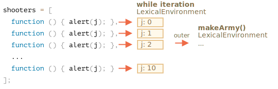
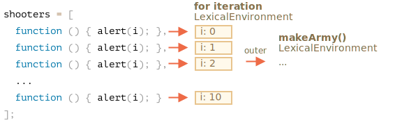

<<<<<<< HEAD
لنُجري مسحًا شاملًا على ما يجري في `‎makeArmy‎`، حينها سيظهر لنا الحل جليًا.
=======
Let's examine what exactly happens inside `makeArmy`, and the solution will become obvious.
>>>>>>> e074a5f825a3d10b0c1e5e82561162f75516d7e3

1. تُنشئ مصفوفة `‎shooters‎` فارغة:

    ```js
    let shooters = [];
    ```
. تملأ المصفوفة في حلقة عبر `‎shooters.push(function...)‎`.

    كلّ عنصر هو دالة، بهذا تكون المصفوفة الناتجة هكذا:


    ```js no-beautify
    shooters = [
      function () { alert(i); },
      function () { alert(i); },
      function () { alert(i); },
      function () { alert(i); },
      function () { alert(i); },
      function () { alert(i); },
      function () { alert(i); },
      function () { alert(i); },
      function () { alert(i); },
      function () { alert(i); }
    ];
    ```

3. تُعيد الدالة المصفوفة.

لاحقًا، يستلم استدعاء `‎army[5]()‎` العنصر `‎army[5]‎` من المصفوفة، وهي دالة فيستدعيها.

<<<<<<< HEAD
الآن، لماذا تعرض كلّ هذه الدوال نفس الناتج؟

يعود ذلك إلى عدم وجود أيّ متغير محلي باسم `‎i‎` في دوال `‎shooter‎`. فحين تُستدعى هذه الدالة تأخذ المتغير `‎i‎` من البيئة المُعجمية الخارجية.
=======
Then, later, the call to any member, e.g. `army[5]()` will get the element `army[5]` from the array (that's a function) and call it.

Now why do all such functions show the same value, `10`?
>>>>>>> e074a5f825a3d10b0c1e5e82561162f75516d7e3

وماذا ستكون قيمة `‎i‎`؟

لو رأينا مصدر القيمة:


```js
function makeArmy() {
  ...
  let i = 0;
  while (i < 10) {
    let shooter = function() { // shooter function
      alert( i ); // should show its number
    };
    ...
  }
  ...
}
```
كما نرى... «تعيش» القيمة في البيئة المُعجمية المرتبطة بدورة `‎makeArmy()‎` الحالية. ولكن متى استدعينا `‎army[5]()‎`، تكون دالة `‎makeArmy‎` قد أنهت مهمّتها فعلًا وقيمة `‎i‎` هي آخر قيمة، أي `‎10‎` (قيمة نهاية حلقة `‎while‎`).

<<<<<<< HEAD
وبهذا تأخذ كلّ دوال `‎shooter‎` القيمة من البيئة المُعجمية الخارجية، ذات القيمة الأخيرة `‎i=10‎`.

يمكن أن نُصلح ذلك بنقل تعريف المتغير إلى داخل الحلقة:

=======
We can see that all `shooter` functions are created in the lexical environment, associated with the one `makeArmy()` run. But when `army[5]()` is called, `makeArmy` has already finished its job, and the final value of `i` is `10`(`while` finishes at `10`).

As the result, all `shooter` functions get the same value from the outer lexical environment and that is, the last value, `i=10`.


>>>>>>> e074a5f825a3d10b0c1e5e82561162f75516d7e3

As you can see above, on each iteration of a `while {...} ` block, a new lexical environment is created. 

So, to fix a problem we can copy the value of `i` into a variable within the `while {...}` block, like this:

```js run
function makeArmy() {
  let shooters = [];

<<<<<<< HEAD
*!*
  for(let i = 0; i < 10; i++) {
*/!*
    let shooter = function() { // دالة مُطلق النار
      alert( i );  // المفترض أن ترينا رقمها
    };
=======
  let i = 0;
  while (i < 10) {
    *!*
      let j = i;
    */!*
      let shooter = function() { // shooter function
        alert( *!*j*/!* ); // should show its number
      };
>>>>>>> e074a5f825a3d10b0c1e5e82561162f75516d7e3
    shooters.push(shooter);
    i++;
  }

  return shooters;
}

let army = makeArmy();

// Now the code works correctly
army[0](); // 0
army[5](); // 5
```

<<<<<<< HEAD
الآن صارت تعمل كما يجب، إذ في كلّ مرة تُنفّذ كتلة الشيفرة في `‎for (let i=0...) {...}‎`، يُنشئ المحرّك بيئة مُعجمية جديدة لها فيها متغير `‎i‎` المناسب لتلك الكتلة.

إذًا لنلخّص: قيمة `‎i‎` صارت «تعيش» أقرب للدالة من السابق. لم تعد في بيئة `‎makeArmy()‎` المُعجمية بل الآن في تلك البيئة المخصّصة لدورة الحلقة الحالية. هكذا صارت تعمل كما يجب.

=======
Here `let j = i` declares an "iteration-local" variable `j` and copies `i` into it. Primitives are copied "by value", so we actually get an independent copy of `i`, belonging to the current loop iteration.

The shooters work correctly, because, the value of `i` now lives a little bit closer. Not in `makeArmy()` Lexical Environment, but in the Lexical Environment that corresponds the current loop iteration:
>>>>>>> e074a5f825a3d10b0c1e5e82561162f75516d7e3



<<<<<<< HEAD
أعدنا كتابة الشيفرة هنا وعوّضنا `‎while‎` بحلقة `‎for‎`.

يمكننا أيضًا تنفيذ حيلة أخرى. لنراها لفهم الموضوع أكثر:


```js run
=======
Such problem could also be avoided if we used `for` in the beginning, like this:

```js run demo
>>>>>>> e074a5f825a3d10b0c1e5e82561162f75516d7e3
function makeArmy() {

  let shooters = [];

*!*
  for(let i = 0; i < 10; i++) {
*/!*
<<<<<<< HEAD
    let shooter = function() { // دالة مُطلق النار
      alert( *!*j*/!* ); // (*) المفترض أن ترينا رقمها
=======
    let shooter = function() { // shooter function
      alert( i ); // should show its number
>>>>>>> e074a5f825a3d10b0c1e5e82561162f75516d7e3
    };
    shooters.push(shooter);
  }

  return shooters;
}

let army = makeArmy();

army[0](); // 0
army[5](); // 5
```

<<<<<<< HEAD
كما حلقة `‎for‎`، فحلقة `‎while‎` تصنع بيئة مُعجمية جديدة لكلّ دورة، وهكذا نتأكّد بأن تكون قيمة `‎shooter‎` صحيحة.

باختصار ننسخ القيمة `‎let j = i‎` وهذا يصنع المتغير `‎j‎` المحلي داخل الحلقة وينسخ قيمة `‎i‎` إلى نفسه. تُنسخ الأنواع الأولية «حسب قيمتها» _By value_، لذا بهذا نأخذ نسخة كاملة مستقلة تمامًا عن `‎i‎`، ولكنّها مرتبطة بالدورة الحالية في الحلقة.
=======
That's essentially, the same, as `for` on each iteration generates the new lexical environment, with its own variable `i`. So `shooter` generated in every iteration references its own `i`, from that very iteration.



Now, as you've put so much effort into reading this, and the final recipe is so simple - just use `for`, you may wonder: was it worth that?

Well, if you could easily answer the question of that task, you wouldn't read the solution, so hopefully this task must have helped you to understand things a bit better. 

Besides, there are indeed cases when one prefers `while` to `for`, and other scenarios where such problems are real.
>>>>>>> e074a5f825a3d10b0c1e5e82561162f75516d7e3

